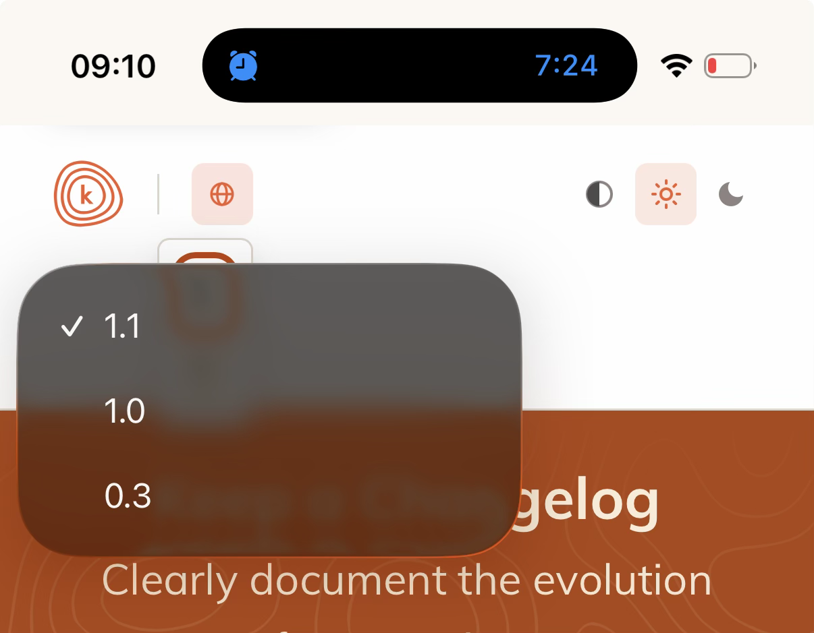
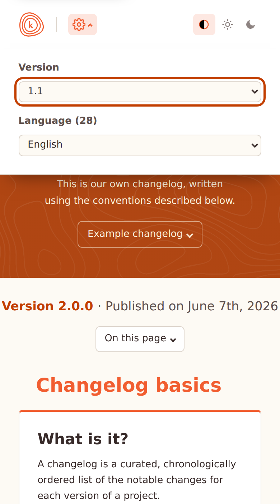
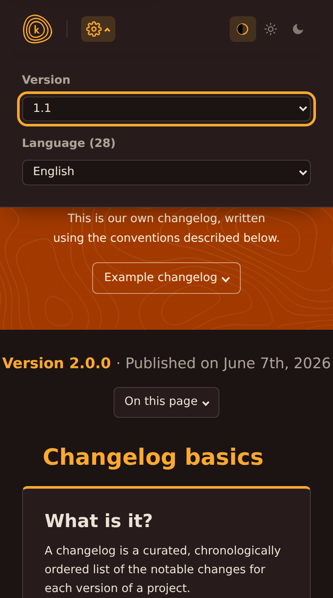
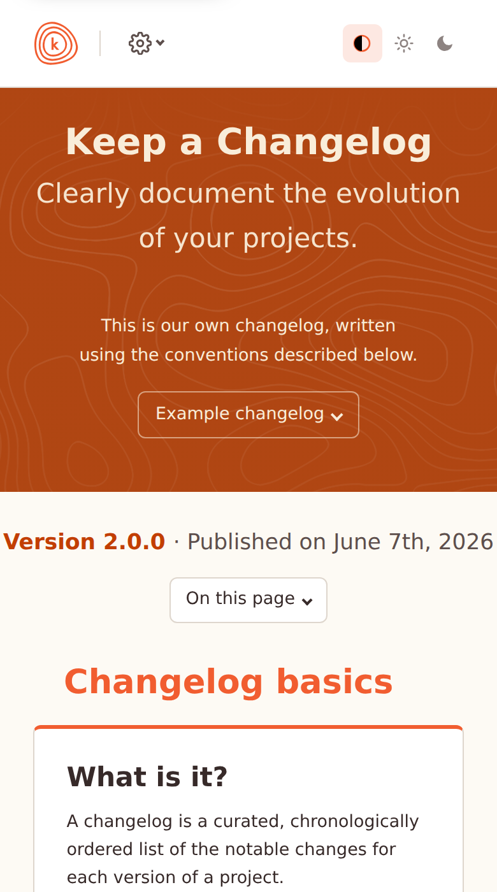
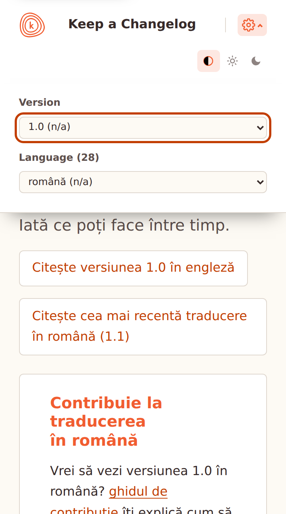

# Narrow-screen version + language picker

Screenshots for [#729](https://github.com/olivierlacan/keep-a-changelog/pull/729),
the redesign of the phone-width picker into a labelled sheet.

## Before

The globe opened a cramped popover: two bare selects with no visible labels,
so tapping a globe (a language cue) landed on unexplained version numbers.

## After

The gear expands the header downward into a full-width sheet with each field
labelled above a full-width select.

| Open (light) | Open (dark) |
| --- | --- |
|  |  |

| Closed header | Missing-translation interstitial |
| --- | --- |
|  |  |
